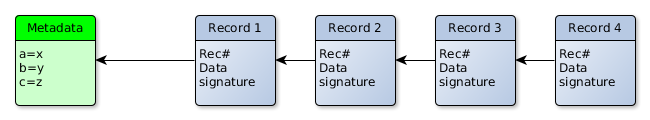
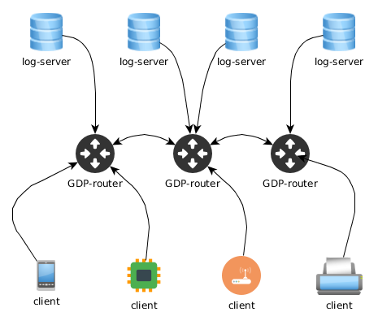

% Introduction to the Global Data Plane

For any questions about this document, send comments to:

- Nitesh Mor, U.C. Berkeley Ubiquitous Swarm Lab, <mor@eecs.berkeley.edu>
- Eric Allman, U.C. Berkeley Ubiquitous Swarm Lab, <eric@cs.berkeley.edu>

---

This is a brief high level introduction to the Global Data Plane, primarily for
users wishing to incorporate GDP in their existing applications.  It is a
living document, subject to change.  In particular we are planning on some
major new functionality which will partly change the interface.

# Introduction

Let's imagine we have a tiny little sensor that measures temperature
periodically and spits out the current temperature. To make this sensor *smart*,
we add some communication capabilities to it. But how does one use the data
generated by this sensor? 

To preserve the data generated by this sensor, let's put the sensor values in a
log-file. A new temperature reading gets appended to this file as the sensor
generates new data. With the log-file approach, we suddenly get quite a few new
capabilities--a user can look at the log file to see historic values, query it
for the latest reading, and so on--all this without adding any functionality to
the sensor itself. As a matter of fact, one doesn't even need to know about the
real sensor anymore; a log file virtualizes this sensor in a way. 

Now, let's bring an actuator (a light bulb, for example) in the picture. The
actuation happens when the actuator receives a certain command over some
communication channel. Let's apply the log-file approach to the actuator
too--the actuator is *subscribed* to a log-file (subscription just means that
the actuator receives any new data in a particular log-file as it arrives). This
gives us a way to virtualize the actuator as well. Anyone intending to actuate a
particular actuator only needs to write the actuation data to a log-file.

# Global Data Plane (GDP)

In GDP, we take this basic abstraction of a log and use this as a communication
and storage mechanism for various entities producing/consuming data. A log in
GDP is nothing more than a place where you can write records (each called a
datum) in a queue/list like fashion.  Any structure in the datum is assigned by
your program; a datum is just an opaque blob of data for the GDP.  Other than
the real data, each datum has a sequence number (starting from one), a
timestamp, and potentially other information (TBD). Logs have some metadata that
tells some general information about the log, e.g. a public key for checking
signatures (Details TBD). Metadata can only be specified when the log is
created.

As for the different software components, there are clients (readers/writers),
routers and log-servers. As a user, you probably need to know only about the
client side. However, just for a little better understanding of the entire
system--a log-server (gdplogd) is a server process that actually stores the
data and responds to commands for reading/writing etc. A router (gdp-router),
as the name implies, routes all the GDP traffic appropriately. As a client
interested in a particular log, you connect to *any* router over a TCP channel.
It is the job of the router to figure out what log-server hosts the log in
question and then route all the communication appropriately.

## Writes and Reads

The write operation for the logs is *append*. A datum written to the log can not
be over-written or changed at a later time. As of now, neither logs nor records
expire (one or both may change in future). There are two versions of append
available in the library provided: synchronous and asynchronous, however they
are just two different ways of implementing the same underlying operation. In
synchronous operation, a writer waits for an acknowledgment before commencing
the next append operation. This might not be the most efficient way to go about
for applications with high performance requirements, hence the asynchronous
operation where the writer can have multiple append operations in transit at a
time. However, note that the synchronous vs asynchronous operation is purely a
difference in how the client library processes the data--internally all
operations are asynchronous. 

The read operation can be performed in a couple of different ways--read a
single record by a record number, read multiple records together with a single
read request, or subscribe to a log to be notified of potential future data.
However, querying a record by the record number is not the best way for all the
situations, because often times the latest few values in a log are of interest.
The question is: as a reader, how are you supposed to know the record number to
be used. For this reason, the record number for a read request can take a
negative value to address the records from most recent first. For instance,
record number -1 refers to the most recent record in a log.

Another important thing to note is that the logs are single-writer--each sensor
has their own log. This makes quite a few things easier for us (encryption,
signatures, data-ordering, etc.). However, there are situations where a
composite log is desired, such as one log for all the temperature sensors in a
building. We envision that a simple aggregation service can subscribe to all the
individual logs, perform some kind of aggregation on those values (for example,
calculating average temperature in a building), and then write those values to a
*composite* log. A *composite* log is also a single writer log where the
aggregation service is the sole writer to the *composite* log.

## Addressing

All objects known to the GDP, including logs and services, exist in a single,
flat, global namespace based on 256-bit numbers (loosely referred to as the
internal name). These are assigned by GDP when the log is created using a
hash of the metadata and public key (the exact composition of this is TBD).
*(At the moment it is possible to specify the data that is hashed for the name,
but this will be changed soon).*  A directory service will map
human-understandable names into internal names (coming soon).

<!--

All communications in the GDP are provided by the GDP Routing Layer.  At the
moment the implementation has limited scalability and does not work with
routers behind NAT firewalls.  We are planning on dropping the second
restriction soon, but the truly global, scalable, peer-to-peer based
implementation will take a bit longer.

At the moment, logs must be created by hand on a specific log server.  This
will be replaced by a log creation service soon.  To have a log created,
contact Eric (eric@cs.berkeley.edu).

-->

## Client side implementation

As of now, at the core of client side distribution is a C library. There are
wrappers around the C library for Python and Java. Wrappers for other languages
tend to run slightly behind in features compared to the C interface, however,
you might find them an easier option if you want an object oriented interface
or are not comfortable programming in C.

Java interface is moderately supported. Contact Christopher
(<cxh@eecs.berkeley.edu>) or Nitesh (<mor@eecs.berkeley.edu>) if you are in
desperate need for a Java interface.  There is also a REST-based interface,
which is covered elsewhere.

## Security and Privacy

The long-term plan is to use encryption for data secrecy and signatures for
authenticity. Ideally, a user reading/writing data from/to GDP should not have
to trust any other component of the system for any verification (not even the
log servers). We envision that we can achieve such guarantees by making the
client side a little smarter and using mathematical techniques such as
encryption. However, it is a work in progress and in the current stage, we do
not provide any such guarantees. 

As mentioned earlier, logs are single-writer. Roughly, each log has a public
signature key included in the log-level metadata; the private part stays with
the intended writer of the log. All the writes are signed using the private
signature key which are verified by the log-server to enforce 1) write access
control, 2) data authenticity. These signatures are included in the on-disk
data and could be queried by a client to make sure that the data was not
modified in any way. Any tampering with record ordering can also be detected,
since the single-writer model allows for the writer to create an implicit
linked-list protected by signatures. However, this is only partly implemented
as of now.

Encryption is used to make data available to only certain users. Ideally,
anyone can read encrypted data but can not make any sense out of it without
access to the decryption key. However, there are limitations to this approach.
Side channels, weak encryption, key-management are some of the many challenges
that need to be solved. 

As for the overhead of signatures/encryption, in the current phase we envision
that if a device can speak the GDP protocol, it can also perform
signature/encryption. Ultra low power devices might offload the entire process
to a more powerful gateway device (a smartphone, for instance).

<!-- Ideally devices will have a key-pair assigned at the factory with only the
public key exposed, although low-power crypto-unaware devices may speak to a
gateway that (optionally) collects data from multiple devices and then signs
and encrypts the data before submitting it to the GDP.

Security is enforced by cryptographic techniques — for example, there are no
ACLs.

Starting from the data acquisition device (for example, a sensor), the model is
that each device will have a key pair created at the factory.  The secret key
will be burned into the device and not be accessible.  Each device has a
corresponding log, and the public key for the device will be included in the
log metadata when the log is created.  The device will sign all outgoing
records using the secret key, and the GDP log server hosting the log will check
the signature before writes are permitted.  The signature is retained with
record, so consumers (readers) may verify the signature themselves.  Very small
and/or low power devices that can not sign themselves will have an intermediate
gateway that does the signing, at the risk of lowered security should the
gateway be compromised or if a Man In The Middle attack can be raised between
the sensor and the gateway.  -->

