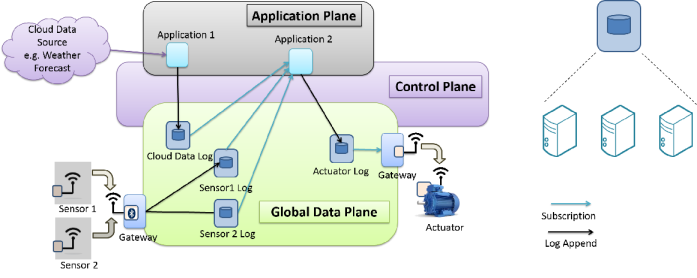

% Writing GDP applications

# A typical application

The log interface acts as a proxy to interact with sensors and actuators. We
describe how one would go about designing a simple application. Imagine an
office building with some temperature sensors and some motor controlled window
blinds. We would like to design an application that looks at the current
temperature and some weather prediction feeds from the cloud to make a smart
decision about the window blinds. 



As shown above, in order to do so, the application subscribes to all the
relevant logs and writes the actuation values to the actuator log. A gateway
working on behalf of the actuator subscribes to this actuation log and controls
the motors for the window blinds. Note that instead of two separate logs, a
composite log can be created for `Sensor 1` and `Sensor 2` in the diagram
above, provided that the gateway implements the single-writer semantics.

---

# Software Installation and Configuration

In this section, we talk about how to get access, install and use the GDP
client side library. As mentioned earlier, we have a C library for clients with
wrappers in other languages around this C-library.

The main GDP repository can be accessed in read-only mode by using

```
git clone https://repo.eecs.berkeley.edu/git-anon/projects/swarmlab/gdp.git
```

Or, in read-write mode either using HTTPS (requires username, password), or
using SSH (requires key setup):

```
git clone https://repo.eecs.berkeley.edu/git/projects/swarmlab/gdp.git
git clone repoman@repo.eecs.berkeley.edu:projects/swarmlab/gdp.git
```

The main GDP repository contains the core GDP library (`libgdp`), client-side
applications and language bindings, and the log-server (`gdplogd`). GDP-router
is maintained in a separate repository (`gdp_router_click.git`).  However, you
should not need to worry about it if you are just playing around with GDP.

The repository `gdp-if.git` contains various interfaces to the GDP.  It is
not really part of the GDP itself, but it may prove instructive.


## Compilation

In summary, assuming you have the required dependencies installed, `make
install-dev-c` should install the C include files, C libraries, and basic
utility applications into system path. `make install-python` should
install the Python bindings in the system path as well. These `make`
targets do not create any necessary configuration files, however (see
below). For more details, refer to README.md in the main git tree.

## Infrastructure information

Refer to README.md in the main git tree.

*Note that the software/infrastructure is still in very early experimental
phase. We do not make any guarantees on data retention/backups at this moment.
As the code stabilizes, we will make better effort to maintain data. In the
meantime, contact us if you would like to use GDP for anything serious.*

## Configuration

The GDP library, log-server, and various other utility programs consult a
configuration file for the correct parameters to use.  At the very minimum, your
configuration file should contain the GDP router that your client should connect
to (unless someone else is running a local router in the same subnet as you are
in, in which case zeroconf should work). Refer to README.md in the main git
tree.

## Creating logs

The main mechanism to create a log is using `gdp-create` (should be in your
system path after `make install-*`). For example,

```
gdp-create -k none org.example.project.log17a
```

will create a log named `org.example.project.log17a` on one of the default
log-servers at Berkeley.

Although you can create logs with any name, please stick to this convention
(with "project" being the project name or the user name, as appropriate) so we
can avoid name collisions. `-k none` means that `gdp-create` will not attempt to
create a new signature key for signing appended data.  Although crucial to the
operation, key-management is better deferred to a stage when you are familiar
with the basic operations of the GDP.  Also, note that `gdp-create` has several
other command-line options that will be useful later on.

Note that if you don't explicitly specify log-placement, a log-server at
Berkeley is picked at random for hosting your log. This is especially important
if you are running your own log-servers and want control over where data goes.

---

# Writing applications in Python

Even though the GDP library is written in C, we provide a python package `gdp`
that acts as a wrapper around the C-library. This python package enables quick
prototyping using an object-oriented interface to GDP. What follows is a quick
how-to on writing simple GDP programs in Python. Note that this document is
just a starting point and is not intended to be a comprehensive guide to the
complete interface. For a more thorough API documentation, refer to
`/lang/python/README`.

## Python package installation

The package `gdp` should be installed in your system path for python packages.
Once you have the required dependencies for compilation installed, something
like `make install-python` from the root of repository should do the trick (note
that running with `sudo` may be required). Note that this also installs the
client side C libraries and various utilities (such as `gdp-create`) in system
path.

## Appending data

Let's start with a simple `Hello world` program, that writes some data to a
log and reads it back. Before we begin, we need to create the log; see *Creating
logs* above. The tutorial uses the logname `edu.berkeley.eecs.mor.01`, but
please replace it with the name of the log you create.

We need to import the package `gdp` to begin with.
 
```python
>>> import gdp
```

Once imported, we need to initialize the GDP package by calling `gdp_init()`.
An optional argument to `gdp_init()` is the address of a GDP-router. If no
address provided, a default value of the parameter `swarm.gdp.routers` is used
as configured by EP library. (See README.md for details).

```python
>>> # the following picks a router based on EP library configuration
>>> gdp.gdp_init()
>>> # For a specific router, use the following:
>>> # gdp.gdp_init('gdp-01.eecs.berkeley.edu:8007')
```

As mentioned earlier, we support human readable names for logs. The mechanism
for translating a human readable name to a 256-bit name is probably going to
change in the future, however, it is our hope that it should be a simple
change. The Python wrapper uses instances of class `gdp.GDP_NAME` for a name,
which could be initialized using a human readable name.

```python
>>> # Create a GDP_NAME object from a human readable python string
>>> gin_name = gdp.GDP_NAME("edu.berkeley.eecs.mor.01")
```

Once we have a `GDP_NAME`, we can use this to open a handle to a log/GCL. A log
handle works like a file handle in some ways. We need to tell whether we want
to open the GCL in read-only mode (`gdp.GDP_MODE_RO`), or append-only mode
(`gdp.GDP_MODE_AO`), or read-and-append mode (`gdp.GDP_MODE_RA`).

```python
>>> # assume that this log already exists.
>>> gin_handle = gdp.GDP_GIN(gin_name, gdp.GDP_MODE_RA)
```

Next, let's append a few records to the log. The unit of read/write to a log is
called a record--data with some automatically generated metadata--represented
by a `GDP_DATUM` object. The `GDP_DATUM` object contains a `GDP_BUF` that holds
the actual data. (Please see the C-api for more details on the behavior of
buffer objects, and such).


```python
>>> d = gdp.GDP_DATUM()
>>> for idx in xrange(10):
...   d["buf"].reset()
...   d["buf"].write("Hello world " + str(idx)}
...   gin_handle.append(d)
```

That's it. Ideally, it should finish without throwing any errors, resulting in
10 records append to the log specified. 

Look at `/lang/python/apps/writer_test.py` for a full example.

## Reading data by record number

Next, let's read some data back and see if it matches what we wrote. Note that
we need to tell what record number we want to read, and record numbers start
from 1. To read data, we just use `read_by_recno` method of the GDP_GIN instance
with the record number.

```python
>>> for idx in xrange(1,11):
...   datum = gin_handle.read_by_recno(idx)
...   print datum["recno"], datum["buf"].peek()
(1, 'Hello world 0')
(2, 'Hello world 1')
(3, 'Hello world 2')
(4, 'Hello world 3')
(5, 'Hello world 4')
(6, 'Hello world 5')
(7, 'Hello world 6')
(8, 'Hello world 7')
(9, 'Hello world 8')
(10, 'Hello world 9')
```

So far, we saw how to read and write data by record number. However, most of
the times, we are interested in the most recent record. For this, we support
negative record numbers, i.e. `-1` refers to the most recent record, `-2`
refers to the second most recent record, and so on.

Look at `/lang/python/apps/reader_test.py` for a full example.

## Subscriptions

Next, let's see how can we subscribe to a log to get new data from a log as it
gets appended. For this, we use `subscribe_by_recno` method of the `gdp.GDP_GIN`
instance.

```python
>>> # ignore the parameters for the moment
>>> gin_handle.subscribe_by_recno(0, 0, None)
```

This subscription returns events, that we need to process in order to get
notified of the data as it appears.

```python
>>> while True:
...   # this blocks until there is a new event
...   event = gin_handle.get_next_event(None)
...   # Events can be used to get the associated datum
...   if event["type"] == gdp.GDP_EVENT_DATA:
...     datum = event["datum"]
...     print datum["buf"].peek()
...   else: 
...     # we ignore other event types for simplicity
...     break
```

In the above code, `event` is an object of type `GDP_EVENT`, which can be used
to get the associated `GDP_DATUM` (and then `GDP_BUF`). In order to see the
above code in action, open another python console (while this is running), and
append some new data to the log just the way you saw above.

Look at `/lang/python/apps/reader_test_subscribe.py` for a full example.

## Reading multiple records at a time

Reading one record at a time can be very inefficient, especially when reading
large amount of data. For this, we support asynchronous reads to read a range of
records at a time. The interface is similar to `subscribe_by_recno` in some
sense--events are returned as a result of an asynchronous call. 

Look at `/lang/python/apps/reader_test_async.py` for a full example.


## Asynchronous write

*Partially implemented*. In the normal `append` call above, a client sends some
data to the log-server and waits for an acknowledgement before returning
control back to the application. In order to convert this blocking operation to
a non-blocking operation, `append_async` could be used instead of regular
`append`.

Refer to the API documentation at `/lang/python/README` for more details.
